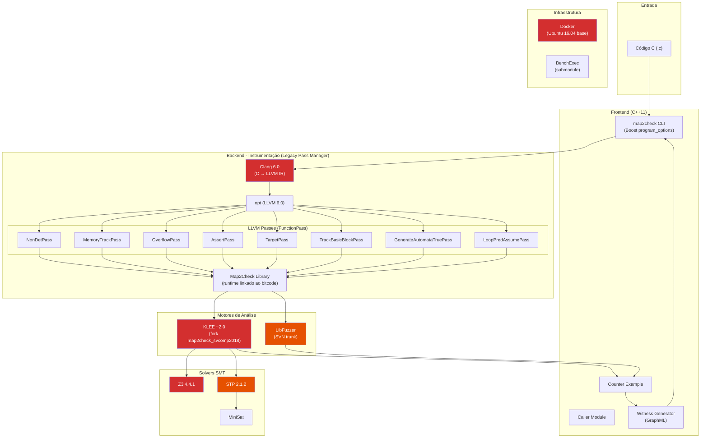
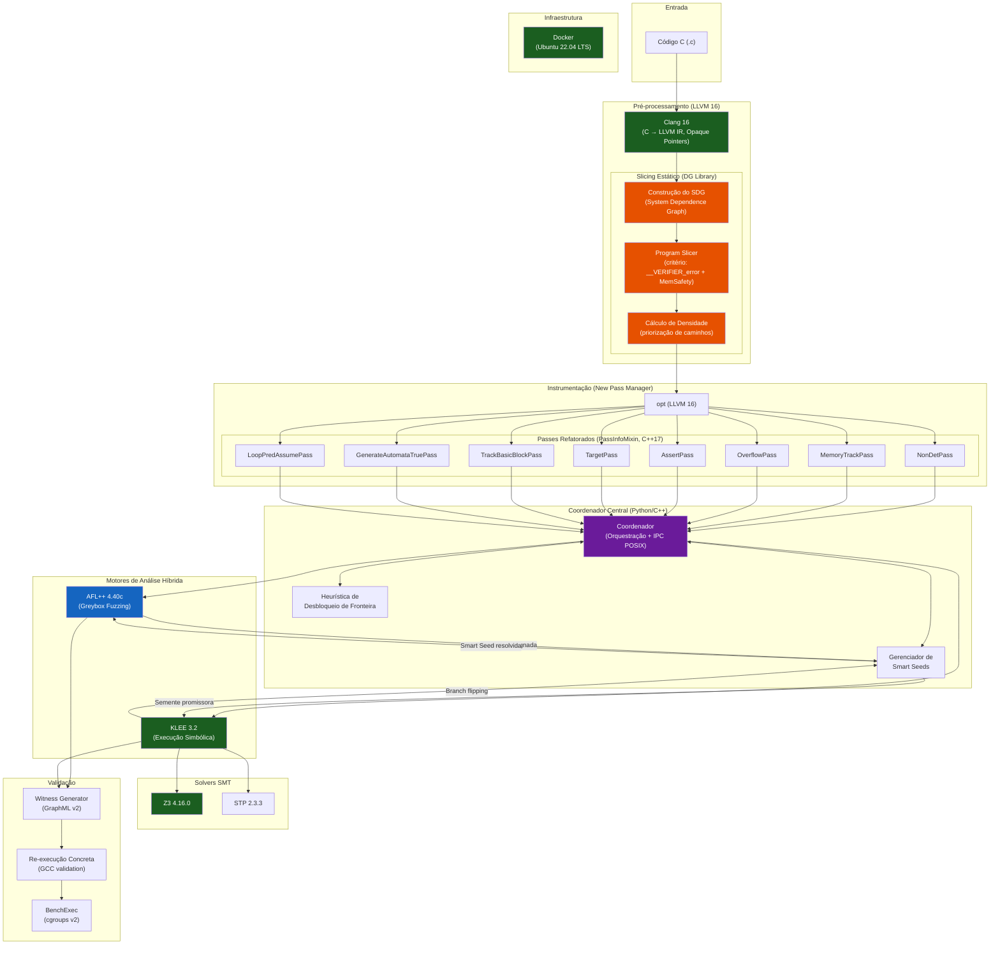
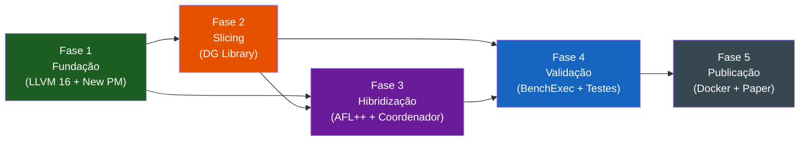

# Map2Check 2.0 — Plano de Migração e Modernização da Stack

## 1. Mapeamento da Stack Atual vs. Stack Alvo

### Stack Atual (Legada)

| Componente | Versão Atual | Observações |
|:---|:---|:---|
| **LLVM/Clang** | 6.0 | Legacy Pass Manager, C++11, typed pointers |
| **KLEE** | fork `map2check_svcomp2018` | Fork customizado baseado em KLEE ~2.0 |
| **Z3 Solver** | 4.4.1 | Muito antigo (2015) |
| **STP Solver** | 2.1.2 | Usado pelo KLEE junto com Z3 |
| **MiniSat** | (sem tag) | Dependência do STP |
| **LibFuzzer** | trunk SVN do LLVM | Integrado ao compiler-rt, via SVN (deprecado) |
| **Boost** | sistema (≥1.58) | program_options, system, filesystem |
| **klee-uclibc** | `klee_0_9_29` | Runtime C library para KLEE |
| **Crab-LLVM** | (presente mas não ativo no build) | Invariantes indutivas (SeaHorn) |
| **C++ Standard** | C++11 | Limitado para APIs modernas |
| **CMake** | ≥ 3.5 | Funcional mas antigo |
| **Docker Base** | `herberthb/base-image-map2check:v2` (Ubuntu 16.04) | EOL há anos |
| **Pass Manager** | Legacy (`FunctionPass`, `ModulePass`) | 8 passes como shared libraries |
| **BenchExec** | Submodule externo | Testes de regressão via Docker |
| **AFL++** | ❌ Ausente | Não integrado |
| **DG (Dependence Graph)** | ❌ Ausente | Não integrado |
| **Coordenador** | ❌ Ausente | Sem orquestração de motores |

### Stack Alvo (Map2Check 2.0)

| Componente | Versão Alvo | Justificativa |
|:---|:---|:---|
| **LLVM/Clang** | **16** | Versão recomendada pelo KLEE 3.2; New Pass Manager padrão; Opaque Pointers |
| **KLEE** | **3.2** (dez/2025) | Suporte oficial LLVM 16, heurísticas de state merging e query caching |
| **Z3 Solver** | **4.16.0** (fev/2026) | Última estável; melhor performance SMT |
| **STP Solver** | **2.3.3** | Versão estável recomendada pelo KLEE |
| **MiniSat** | última estável | Dependência do STP |
| **AFL++** | **4.40c** | Suporte LLVM 14–22; fuzzing guiado por cobertura |
| **klee-uclibc** | compatível com KLEE 3.2 | Runtime atualizado |
| **DG Library** | última master (`mchalupa/dg`) | Slicing estático via SDG |
| **Boost** | ≥ 1.74 | Compatível com C++17 |
| **C++ Standard** | **C++17** | `std::optional`, `std::filesystem`, structured bindings |
| **CMake** | ≥ 3.20 | Suporte moderno a presets e FetchContent |
| **Docker Base** | **Ubuntu 22.04 LTS** | Suporte até 2027 |
| **Pass Manager** | **New PM** (`PassInfoMixin`) | `PreservedAnalyses`, lazy analysis |
| **Coordenador** | **Novo componente** (Python/C++) | Orquestração AFL++ ↔ KLEE via IPC POSIX |
| **BenchExec** | atualizado | Integração com cgroups v2 |

---

## 2. Diagramas de Arquitetura

### 2.1 Arquitetura Atual (Map2Check v7.x)



> [!WARNING]
> Componentes em **vermelho** estão criticamente desatualizados. LibFuzzer usa SVN (descontinuado). KLEE é um fork congelado. Z3 tem 10+ anos de atraso.

### 2.2 Arquitetura Alvo (Map2Check 2.0)



> [!TIP]
> **Verde** = componentes modernizados. **Azul** = novo motor (AFL++). **Roxo** = novo componente (Coordenador). **Laranja** = nova capacidade (DG Slicing).

---

## 3. Plano de Implementação — Passo a Passo

### Fase 1: Fundação (Meses 1-3)

#### Passo 1.1 — Atualizar infraestrutura Docker e CI
- [ ] Criar novo `Dockerfile` baseado em **Ubuntu 22.04 LTS**
- [ ] Instalar dependências de build: `build-essential`, `cmake ≥ 3.20`, `ninja-build`, `python3`, `pip`
- [ ] Baixar e instalar **LLVM 16** pre-built ou compilar do source
- [ ] Configurar CI (GitHub Actions) substituindo Travis CI
- [ ] Validar que o container compila um "hello world" com Clang 16

#### Passo 1.2 — Migrar CMakeLists.txt raiz
- [ ] Atualizar `cmake_minimum_required` para 3.20
- [ ] Alterar `CMAKE_CXX_STANDARD` de `11` para `17`
- [ ] Atualizar `FindClang.cmake` para localizar LLVM 16
- [ ] Remover referências SVN do `FindLibFuzzer.cmake` (LibFuzzer agora é parte do compiler-rt no LLVM 16)
- [ ] Atualizar `FindZ3.cmake`: tag `z3-4.4.1` → `z3-4.16.0`
- [ ] Atualizar `FindSTP.cmake`: tag `2.1.2` → `2.3.3`
- [ ] Atualizar `FindKlee.cmake`: apontar para KLEE 3.2 oficial (não mais o fork)
- [ ] Atualizar `FindKleeUCLibC.cmake`: tag compatível com KLEE 3.2

#### Passo 1.3 — Migrar Passes para New Pass Manager
**Esta é a mudança mais impactante.** Cada um dos 8 passes precisa ser reescrito.

**Padrão de migração (para cada pass):**

```diff
- // ANTES (Legacy)
- #include <llvm/Pass.h>
- struct MyPass : public FunctionPass {
-   static char ID;
-   MyPass() : FunctionPass(ID) {}
-   bool runOnFunction(Function &F) override;
- };

+ // DEPOIS (New PM)
+ #include <llvm/IR/PassManager.h>
+ struct MyPass : public PassInfoMixin<MyPass> {
+   PreservedAnalyses run(Function &F, FunctionAnalysisManager &AM);
+ };
```

**Ordem de migração recomendada (menor → maior complexidade):**

| # | Pass | Complexidade | Linhas |
|:--|:-----|:-------------|:-------|
| 1 | `AssertPass` | Baixa | ~60 |
| 2 | `TargetPass` | Baixa | ~60 |
| 3 | `LoopPredAssumePass` | Baixa | ~70 |
| 4 | `Map2CheckLibrary` | Baixa | ~80 |
| 5 | `NonDetPass` | Média | ~230 |
| 6 | `OverflowPass` | Média | ~380 |
| 7 | `TrackBasicBlockPass` | Alta | ~280 |
| 8 | `MemoryTrackPass` | Alta | ~700 |

**Checklist por pass:**
- [ ] Substituir herança `FunctionPass` → `PassInfoMixin<T>`
- [ ] Remover `static char ID` e construtor com `FunctionPass(ID)`
- [ ] Renomear `runOnFunction` → `run(Function&, FunctionAnalysisManager&)`
- [ ] Alterar retorno `bool` → `PreservedAnalyses`
- [ ] Atualizar includes: `<llvm/Pass.h>` → `<llvm/IR/PassManager.h>`
- [ ] Adaptar acesso a análises: `getAnalysis<>()` → `AM.getResult<>()`
- [ ] Resolver breaking changes de Opaque Pointers (LLVM 16)
- [ ] Atualizar `CMakeLists.txt` do pass (registro no pipeline)
- [ ] Escrever teste unitário de regressão

#### Passo 1.4 — Adaptar para Opaque Pointers (LLVM 16)
- [ ] Remover usos de `PointerType::getElementType()` (deprecado)
- [ ] Usar `Type*` explícito em instruções GEP, Load, Store
- [ ] Atualizar `IRBuilder` calls para nova assinatura com tipo explícito

#### Passo 1.5 — Atualizar código C++ para C++17
- [ ] Substituir `llvm::make_unique` → `std::make_unique`
- [ ] Substituir `boost::filesystem` → `std::filesystem` onde possível
- [ ] Usar `std::optional`, `std::string_view`, structured bindings
- [ ] Substituir `_GLIBCXX_USE_CXX11_ABI=0` pelo ABI padrão

#### Passo 1.6 — Testes de regressão da instrumentação
- [ ] Compilar programas de teste simples com overflow, memtrack, assert
- [ ] Verificar que o bitcode instrumentado é gerado corretamente
- [ ] Comparar saídas (TRUE/FALSE/UNKNOWN) com baseline v7.x

---

### Fase 2: Integração de Slicing (Meses 4-5)

#### Passo 2.1 — Integrar a biblioteca DG
- [ ] Adicionar `FindDG.cmake` para compilar `mchalupa/dg` como dependência externa
- [ ] Configurar DG para LLVM 16
- [ ] Validar que o slicer standalone (`llvm-slicer`) funciona no container

#### Passo 2.2 — Implementar módulo de pré-processamento de slicing
- [ ] Criar módulo `SlicingPreprocessor` em `modules/backend/slicing/`
- [ ] Definir critério de slicing automático:
  - Chamadas a `__VERIFIER_error()`
  - Instruções de acesso à memória (para MemSafety)
- [ ] Integrar construção do SDG (System Dependence Graph)
- [ ] Implementar cálculo de densidade de dependências

#### Passo 2.3 — Pipeline de slicing no frontend
- [ ] Adicionar opção `--slice` ao CLI
- [ ] Integrar o slicer no pipeline: `C → IR → Slice → Instrumentação → Análise`
- [ ] Medir redução de tamanho do bitcode em benchmarks SV-COMP

#### Passo 2.4 — Validação do impacto do slicing
- [ ] Executar benchmarks ReachSafety com e sem slicing
- [ ] Medir: tamanho do bitcode, tempo de verificação, taxa de unknown
- [ ] Documentar resultados comparativos

---

### Fase 3: Hibridização e Coordenador (Meses 6-8)

#### Passo 3.1 — Integrar AFL++
- [ ] Adicionar `FindAFLPlusPlus.cmake` para compilar/instalar AFL++ 4.40c
- [ ] Configurar instrumentação AFL++ com LLVM 16 (modo PCGUARD)
- [ ] Criar wrapper para compilação de programas com instrumentação AFL++
- [ ] Validar fuzzing standalone em programas de teste

#### Passo 3.2 — Desenvolver o Coordenador
- [ ] Criar módulo `modules/coordinator/` (Python + C++ via pybind11 ou subprocess)
- [ ] Implementar interface IPC POSIX (shared memory + semáforos)
- [ ] Implementar ciclo de vida:
  1. Iniciar AFL++ com sementes iniciais
  2. Monitorar cobertura e detectar estagnação
  3. Extrair sementes promissoras
  4. Invocar KLEE para branch flipping
  5. Reinjetar Smart Seeds no AFL++

#### Passo 3.3 — Implementar heurística de Desbloqueio de Fronteira
- [ ] Detectar **Saturação Local**: AFL++ sem novos caminhos por `Δt`
- [ ] Detectar **Proximidade de Fronteira**: branch com aresta não tomada
- [ ] Implementar lógica de priorização baseada em densidade do SDG
- [ ] Configurar parâmetros de tempo e energia ajustáveis

#### Passo 3.4 — Gerenciador de Smart Seeds
- [ ] Serialização/deserialização de sementes entre AFL++ e KLEE
- [ ] Conversão de formatos: test-case KLEE → seed AFL++ e vice-versa
- [ ] Filtro de duplicatas e ranking por densidade SDG

---

### Fase 4: Validação e Ajuste Fino (Meses 9-10)

#### Passo 4.1 — Integração com BenchExec
- [ ] Atualizar módulo BenchExec para cgroups v2
- [ ] Criar tool-info module para Map2Check 2.0
- [ ] Configurar limites de recursos (CPU, memória, tempo)

#### Passo 4.2 — Validação de testemunhos
- [ ] Implementar re-execução concreta com GCC
- [ ] Compilar o programa original, injetar contraexemplo, verificar crash
- [ ] Integrar validação no pipeline de saída

#### Passo 4.3 — Benchmarking extensivo
- [ ] Executar suítes ReachSafety, MemSafety da SV-COMP
- [ ] Comparar com baseline v7.x: taxa de unknown, cobertura, pontuação
- [ ] Ajustar heurísticas do Coordenador (Δt, energy, priorização)

---

### Fase 5: Empacotamento e Publicação (Meses 11-12)

#### Passo 5.1 — Docker de produção
- [ ] Criar Dockerfile multi-stage otimizado
- [ ] Incluir todo o toolchain: LLVM 16, KLEE 3.2, AFL++ 4.40c, Z3 4.16.0, DG
- [ ] Publicar imagem no Docker Hub / GitHub Container Registry

#### Passo 5.2 — Documentação e wrapper SV-COMP
- [ ] Atualizar `map2check-wrapper.py` para nova arquitetura
- [ ] Atualizar `README.md` com instruções de build e uso
- [ ] Gerar documentação técnica (Doxygen)

#### Passo 5.3 — Submissão
- [ ] Preparar pacote de submissão SV-COMP
- [ ] Escrever artigo descrevendo a nova arquitetura
- [ ] Submeter a conferência (CBSoft, ISSTA, ou similar)

---

## 4. Matriz de Risco e Mitigação

| Risco | Impacto | Probabilidade | Mitigação |
|:------|:--------|:--------------|:----------|
| API breaking changes LLVM 16 nos passes | Alto | Alta | Migrar pass por pass com testes de regressão |
| DG incompatível com LLVM 16 | Médio | Média | Compilar DG do master; contribuir patches upstream |
| IPC instável entre AFL++ e KLEE | Alto | Média | Prototipar IPC cedo (Fase 2); ter fallback para modo sequencial |
| KLEE 3.2 com comportamento diferente do fork | Médio | Média | Manter fork como fallback; adaptar configurações gradualmente |
| Timeout em benchmarks mesmo após slicing | Médio | Baixa | Ajustar critérios de slicing; implementar timeout adaptativo |

---

## 5. Dependências Críticas entre Fases



> [!IMPORTANT]
> **A Fase 1 é bloqueante para todas as demais.** As Fases 2 e 3 podem ter trabalho paralelo parcial (ex: prototipar o Coordenador enquanto os passes são migrados), mas a integração final depende da conclusão da Fase 1.
