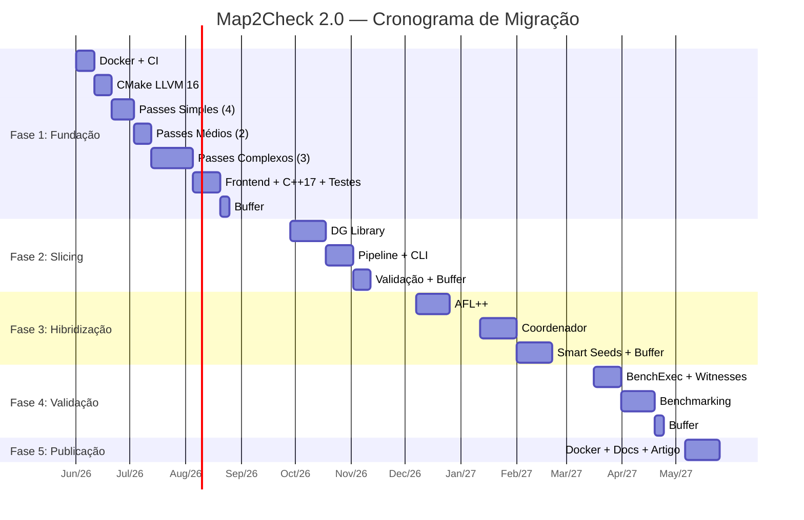

# Map2Check 2.0 — Cronograma de Migração

**Início:** 01/Jun/2026 (Segunda)  
**Fim previsto:** 30/Mai/2027  
**Regime:** ~5h/dia útil de desenvolvimento efetivo  

---

## Métricas do Codebase Atual

| Componente | Linhas | Arquivos |
|:-----------|:-------|:---------|
| **Passes LLVM** (backend) | ~3,500 | 23 (.cpp/.hpp) |
| **Frontend** (CLI, caller, witness, utils) | ~4,025 | 19 |
| **Backend Library** (runtime C) | ~3,700 | ~30 (.c/.h) |
| **Testes unitários** | 326 | 6 |
| **Testes de regressão** | 9 casos | — |

### Complexidade dos Passes (ordem de migração)

| # | Pass | .cpp | .hpp | Total | Complexidade |
|:--|:-----|:-----|:-----|:------|:-------------|
| 1 | AssertPass | 72 | 62 | 134 | 🟢 Baixa |
| 2 | TargetPass | 72 | 68 | 140 | 🟢 Baixa |
| 3 | LoopPredAssumePass | 88 | 61 | 149 | 🟢 Baixa |
| 4 | Map2CheckLibrary | 94 | 65 | 159 | 🟢 Baixa |
| 5 | NonDetPass | 214 | 113 | 327 | 🟡 Média |
| 6 | TrackBasicBlockPass | 317 | 85 | 402 | 🟡 Média |
| 7 | OverflowPass | 444 | 79 | 523 | 🟠 Alta |
| 8 | GenerateAutomataTruePass | 598 | 107 | 705 | 🟠 Alta |
| 9 | MemoryTrackPass | 814 | 102 | 916 | 🔴 Muito Alta |

---

## FASE 0 — Preparação Pré-Migração (Mai/2026) — 1 semana

| Done | ID | Tarefa | Início | Fim | Dias | Teste | Relatório |
|:-----|:---|:-------|:-------|:----|:-----|:------|:----------|
| ✅ | 0.1 | Incorporar mudanças da PR #44 (`--nondet-generator fuzzer/symex`) da branch `fuzzer-option` | 19/Mai | 17/Mai | 1 | Build OK + testes unitários 7/7 + regressão manual com `--nondet-generator fuzzer` e `--nondet-generator symex` | `docs/migration/0.1-pr44-nondet-generator.md` |
| ✅ | 0.2 | Executar suite completa de testes (unit + regressão) e registrar baseline definitivo da branch de trabalho | 17/Mai | 17/Mai | 1 | 7/7 unit + 9/9 regressão documentados com resultados exatos | `docs/migration/0.2-baseline-pre-migration.md` |

> **Entregável:** Branch de trabalho com PRs #44 e #46 integradas + baseline documentado
> **Critério:** Todos os testes executados e resultados registrados em `docs/migration/`

---

## FASE 1 — Fundação (Jun–Ago/2026) — 13 semanas

### 1.1 Infraestrutura Docker + CI (Semanas 1-2)

| Done | ID | Tarefa | Início | Fim | Dias | Teste | Relatório |
|:-----|:---|:-------|:-------|:----|:-----|:------|:----------|
| ✅ | 1.1.1 | Criar `Dockerfile.dev` baseado em Ubuntu 22.04 | 01/Jun | 17/Mai | 3 | Container compila `hello.c` com Clang 16 | — |
| ✅ | 1.1.2 | Instalar LLVM 16 pre-built no container | 04/Jun | 17/Mai | 2 | `clang-16 --version` e `opt --version` OK | — |
| ✅ | 1.1.3 | Instalar dependências (Boost ≥1.74, CMake ≥3.20, Ninja) | 08/Jun | 17/Mai | 1 | `cmake --version` ≥ 3.20 | — |
| ☐ | 1.1.4 | Configurar GitHub Actions CI (build + unit tests) | 09/Jun | — | 3 | Push dispara CI, badge verde | — |
| ✅ | 1.1.5 | **Teste integrado**: build de um pass simples no novo container | 12/Jun | 17/Mai | 1 | AssertPass compila como shared lib | `docs/migration/1.1-dockerfile-llvm16.md` |

> **Entregável:** Docker image funcional com LLVM 16 + CI operacional  
> **Critério de aceitação:** `docker build` + `docker run make-unit-test.sh` sem erros

### 1.2 Migração do CMake (Semanas 3-4)

| Done | ID | Tarefa | Início | Fim | Dias | Teste | Relatório |
|:-----|:---|:-------|:-------|:----|:-----|:------|:----------|
| ✅ | 1.2.1 | Atualizar `CMakeLists.txt` raiz (`cmake_minimum_required 3.20`, `CXX_STANDARD 17`) | 15/Jun | 30/Mai | 1 | `cmake ..` sem erros | — |
| ✅ | 1.2.2 | Atualizar `FindClang.cmake` para LLVM 16 | 16/Jun | 30/Mai | 2 | Localiza `clang-16`, `opt`, `llvm-link` | — |
| ✅ | 1.2.3 | Atualizar `FindZ3.cmake` (Z3 4.8.12 via apt) | 18/Jun | 30/Mai | 1 | Z3 encontrado via find_package | — |
| ✅ | 1.2.4 | Atualizar `FindSTP.cmake` (STP 2.3.4) | 19/Jun | 30/Mai | 1 | STP encontrado em /usr/local | — |
| ✅ | 1.2.5 | Atualizar `FindKlee.cmake` para KLEE 3.1 oficial | 22/Jun | 30/Mai | 2 | KLEE encontrado em /opt/klee | — |
| ✅ | 1.2.6 | Atualizar `FindKleeUCLibC.cmake` compatível KLEE 3.1 | 24/Jun | 30/Mai | 1 | uclibc encontrado em /opt/klee-uclibc | — |
| ✅ | 1.2.7 | Remover SVN refs de `FindLibFuzzer.cmake` (usar compiler-rt LLVM 16) | 25/Jun | 30/Mai | 1 | LibFuzzer disponível via compiler-rt | — |
| ✅ | 1.2.8 | Atualizar GoogleTest para `release-1.12.1` (já feito no baseline) | 26/Jun | 30/Mai | 1 | Testes unitários compilam | — |
| ✅ | 1.2.9 | **Teste integrado**: `cmake .. -G Ninja` completo sem erros | 26/Jun | 30/Mai | — | Build system configura 100% | `docs/migration/1.2-cmake-llvm16.md` |

> **Entregável:** Build system completo LLVM 16  
> **Critério:** `cmake` + `ninja` compilam pelo menos o frontend e a backend library (passes ainda Legacy)

### 1.3 Migração dos Passes para New Pass Manager (Semanas 5-10)

**Padrão por pass:**
1. Reescrever `.hpp` → `PassInfoMixin<T>`, remover `static char ID`
2. Reescrever `.cpp` → `run(Function&, FunctionAnalysisManager&)` retornando `PreservedAnalyses`
3. Adaptar Opaque Pointers (sem `getElementType()`)
4. Atualizar `CMakeLists.txt` (registro no pipeline)
5. Compilar e testar isoladamente
6. Rodar suite de regressão completa

#### Passes simples (Semanas 5-6)

| Done | ID | Pass | Início | Fim | Dias | Teste | Relatório |
|:-----|:---|:-----|:-------|:----|:-----|:------|:----------|
| ✅ | 1.3.1 | **AssertPass** (134 linhas) | 29/Jun | 30/Mai | 3 | Compilação OK | `docs/migration/1.3.1-assert-pass.md` |
| ✅ | 1.3.2 | **TargetPass** (140 linhas) | 02/Jul | 30/Mai | 3 | Compilação OK | `docs/migration/1.3.2-target-pass.md` |
| ✅ | 1.3.3 | **LoopPredAssumePass** (149 linhas) | 07/Jul | 30/Mai | 3 | Compilação OK | `docs/migration/1.3.3-looppredassumepass.md` |
| ✅ | 1.3.4 | **Map2CheckLibrary** (159 linhas) | 10/Jul | 30/Mai | 3 | Compilação OK | `docs/migration/1.3.4-map2checklibrary.md` |

#### Passes médios (Semanas 7-8)

| Done | ID | Pass | Início | Fim | Dias | Teste | Relatório |
|:-----|:---|:-----|:-------|:----|:-----|:------|:----------|
| ✅ | 1.3.5 | **NonDetPass** (327 linhas) | 15/Jul | 30/Mai | 5 | Compilação OK | — |
| ✅ | 1.3.6 | **TrackBasicBlockPass** (402 linhas) | 22/Jul | 30/Mai | 5 | Compilação OK | — |

#### Passes complexos (Semanas 9-10)

| Done | ID | Pass | Início | Fim | Dias | Teste | Relatório |
|:-----|:---|:-----|:-------|:----|:-----|:------|:----------|
| ✅ | 1.3.7 | **OverflowPass** (523 linhas) | 29/Jul | 30/Mai | 7 | Compilação OK | — |
| ✅ | 1.3.8 | **GenerateAutomataTruePass** (705 linhas) | 07/Ago | 30/Mai | 7 | Compilação OK | — |
| ✅ | 1.3.9 | **MemoryTrackPass** (916 linhas) | 18/Ago | 30/Mai | 9 | Compilação OK | `docs/migration/1.3-passes-new-pm.md` |

### 1.4 Adaptações Finais Fase 1 (Semanas 11-13)

| Done | ID | Tarefa | Início | Fim | Dias | Teste | Relatório |
|:-----|:---|:-------|:-------|:----|:-----|:------|:----------|
| ✅ | 1.4.1 | Adaptar frontend (`caller.cpp`, `map2check.cpp`) para nova invocação de passes | 31/Ago | 30/Mai | 5 | CLI funcional, `map2check --version` OK | `docs/migration/1.4-frontend-cpp17.md` |
| ✅ | 1.4.2 | Migrar código C++ para C++17 (`std::make_unique`, `std::filesystem`, etc.) | 07/Set | 30/Mai | 5 | Build limpo Clang 16, 3 warnings pré-existentes | `docs/migration/1.4-frontend-cpp17.md` |
| ✅ | 1.4.3 | **Suite completa de testes** — unit + plugins + TestComp Heap completo | 14/Set | 12-13/Jun | 3 | 7/7 unit ✅ + 9/9 plugins ✅ + 594 tasks Heap (score 57, 98.8% accuracy) | `docs/migration/1.4.3-checkpoint-testcomp2026.md` |
| ☐ | 1.4.4 | Documentação: changelog, README atualizado | 17/Set | 18/Set | 2 | README com instruções de build LLVM 16 | — |
| ☐ | 1.4.5 | **Buffer/contingência** | 21/Set | 25/Set | 5 | — | — |

> **Marco Fase 1:** Map2Check compilando e rodando 100% com LLVM 16 + New PM  
> **Data-alvo:** 25/Set/2026

---

## FASE 2 — Integração de Slicing (Out–Nov/2026) — 9 semanas

### 2.1 Integração da DG Library (Semanas 14-17)

| Done | ID | Tarefa | Início | Fim | Dias | Teste | Relatório |
|:-----|:---|:-------|:-------|:----|:-----|:------|:----------|
| ☐ | 2.1.1 | Criar `FindDG.cmake` (FetchContent de `mchalupa/dg`) | 28/Set | 30/Set | 3 | DG compila com LLVM 16 | — |
| ☐ | 2.1.2 | Validar `llvm-slicer` standalone no container | 01/Out | 02/Out | 2 | Slice de programa simples funciona | — |
| ☐ | 2.1.3 | Criar módulo `SlicingPreprocessor` (API C++) | 05/Out | 16/Out | 10 | Testes unitários do módulo | — |
| ☐ | 2.1.4 | Definir critério de slicing automático (`__VERIFIER_error` + MemSafety) | 19/Out | 23/Out | 5 | Slice preserva instruções de interesse | `docs/migration/2.1-dg-library.md` |

### 2.2 Integração no Pipeline (Semanas 18-20)

| Done | ID | Tarefa | Início | Fim | Dias | Teste | Relatório |
|:-----|:---|:-------|:-------|:----|:-----|:------|:----------|
| ☐ | 2.2.1 | Adicionar opção `--slice` ao CLI | 26/Out | 27/Out | 2 | `map2check --help` mostra opção | — |
| ☐ | 2.2.2 | Integrar pipeline: `C → IR → Slice → Instrumentação → Análise` | 28/Out | 06/Nov | 8 | Suite completa com `--slice` ativo | — |
| ☐ | 2.2.3 | Testes comparativos: com e sem slicing nos 9 benchmarks | 09/Nov | 13/Nov | 5 | Tabela de redução de tamanho bitcode | — |
| ☐ | 2.2.4 | Testes em benchmarks SV-COMP ReachSafety (amostra) | 16/Nov | 20/Nov | 5 | ≥ baseline em cobertura | `docs/migration/2.2-slicing-pipeline.md` |

### 2.3 Validação e Buffer (Semanas 21-22)

| Done | ID | Tarefa | Início | Fim | Dias | Teste | Relatório |
|:-----|:---|:-------|:-------|:----|:-----|:------|:----------|
| ☐ | 2.3.1 | Medir impacto: memória, tempo, taxa de unknown | 23/Nov | 27/Nov | 5 | Relatório quantitativo | `docs/migration/2.3-fase2-final.md` |
| ☐ | 2.3.2 | **Buffer/contingência** | 30/Nov | 04/Dez | 5 | — | — |

> **Marco Fase 2:** Slicing funcional, redução mensurável em timeouts  
> **Data-alvo:** 04/Dez/2026

---

## FASE 3 — Hibridização e Coordenador (Dez/2026–Fev/2027) — 12 semanas

### 3.1 Integração AFL++ (Semanas 23-26)

| Done | ID | Tarefa | Início | Fim | Dias | Teste | Relatório |
|:-----|:---|:-------|:-------|:----|:-----|:------|:----------|
| ☐ | 3.1.1 | `FindAFLPlusPlus.cmake` — compilar/instalar AFL++ 4.40c | 07/Dez | 11/Dez | 5 | `afl-fuzz --version` OK | — |
| ☐ | 3.1.2 | Instrumentação AFL++ com LLVM 16 (modo PCGUARD) | 14/Dez | 18/Dez | 5 | Programa de teste instrumentado e fuzzado | — |
| ☐ | 3.1.3 | Wrapper de compilação para programas com instrumentação AFL++ | 21/Dez | 24/Dez | 4 | Programa fuzzeado encontra crash | — |
| ☐ | 3.1.4 | Validação: fuzzing standalone em benchmarks simples | 05/Jan | 09/Jan | 5 | ≥3 crashes encontrados em programas unsafe | `docs/migration/3.1-aflpp.md` |

### 3.2 Coordenador Central (Semanas 27-30)

| Done | ID | Tarefa | Início | Fim | Dias | Teste | Relatório |
|:-----|:---|:-------|:-------|:----|:-----|:------|:----------|
| ☐ | 3.2.1 | Criar módulo `coordinator/` (Python + subprocess) | 12/Jan | 16/Jan | 5 | Testes unitários do módulo | — |
| ☐ | 3.2.2 | IPC POSIX: shared memory + semáforos | 19/Jan | 23/Jan | 5 | Comunicação bidirecional testada | — |
| ☐ | 3.2.3 | Ciclo de vida: AFL++ → monitoramento → KLEE → reinjeção | 26/Jan | 06/Fev | 10 | Programa simples verificado end-to-end | — |
| ☐ | 3.2.4 | Heurística de Desbloqueio de Fronteira (Δt, proximidade) | 09/Fev | 13/Fev | 5 | Detecção de estagnação + branch flipping | `docs/migration/3.2-coordinator.md` |

### 3.3 Smart Seeds e Validação (Semanas 31-34)

| Done | ID | Tarefa | Início | Fim | Dias | Teste | Relatório |
|:-----|:---|:-------|:-------|:----|:-----|:------|:----------|
| ☐ | 3.3.1 | Gerenciador de Smart Seeds (serialização, conversão, filtro) | 16/Fev | 20/Fev | 5 | Seeds transferidas AFL++ ↔ KLEE | — |
| ☐ | 3.3.2 | Ranking por densidade SDG | 23/Fev | 27/Fev | 5 | Seeds priorizadas corretamente | — |
| ☐ | 3.3.3 | Teste integrado: pipeline completo com coordenação | 02/Mar | 06/Mar | 5 | Benchmark com melhoria de cobertura | `docs/migration/3.3-fase3-final.md` |
| ☐ | 3.3.4 | **Buffer/contingência** | 09/Mar | 13/Mar | 5 | — | — |

> **Marco Fase 3:** Coordenador funcional, AFL++ ↔ KLEE com Smart Seeds  
> **Data-alvo:** 13/Mar/2027

---

## FASE 4 — Validação e Ajuste Fino (Mar–Abr/2027) — 8 semanas

### 4.1 BenchExec + Testemunhos (Semanas 35-38)

| Done | ID | Tarefa | Início | Fim | Dias | Teste | Relatório |
|:-----|:---|:-------|:-------|:----|:-----|:------|:----------|
| ☐ | 4.1.1 | Atualizar BenchExec para cgroups v2 | 16/Mar | 18/Mar | 3 | BenchExec roda no container | — |
| ☐ | 4.1.2 | Criar tool-info module Map2Check 2.0 | 19/Mar | 23/Mar | 3 | BenchExec reconhece map2check | — |
| ☐ | 4.1.3 | Re-execução concreta com GCC (validação de witness) | 24/Mar | 30/Mar | 5 | Contraexemplo reproduzido via GCC | — |
| ☐ | 4.1.4 | Integrar validação no pipeline de saída | 31/Mar | 03/Abr | 4 | Witness validado automaticamente | `docs/migration/4.1-benchexec-witness.md` |

### 4.2 Benchmarking Extensivo (Semanas 39-42)

| Done | ID | Tarefa | Início | Fim | Dias | Teste | Relatório |
|:-----|:---|:-------|:-------|:----|:-----|:------|:----------|
| ☐ | 4.2.1 | Executar suíte ReachSafety SV-COMP | 06/Abr | 10/Abr | 5 | Relatório com pontuação | — |
| ☐ | 4.2.2 | Executar suíte MemSafety SV-COMP | 13/Abr | 17/Abr | 5 | Relatório com pontuação | — |
| ☐ | 4.2.3 | Comparação com baseline v7.3.1 | 20/Abr | 22/Abr | 3 | Tabela comparativa completa | — |
| ☐ | 4.2.4 | Ajuste de heurísticas (Δt, energy, priorização) | 23/Abr | 30/Abr | 6 | Melhoria mensurável vs. iteração anterior | — |
| ☐ | 4.2.5 | **Buffer/contingência** | 01/Mai | 05/Mai | 5 | — | `docs/migration/4.2-fase4-final.md` |

> **Marco Fase 4:** Resultados quantitativos publicáveis  
> **Data-alvo:** 05/Mai/2027

---

## FASE 5 — Empacotamento e Publicação (Mai/2027) — 4 semanas

| Done | ID | Tarefa | Início | Fim | Dias | Teste | Relatório |
|:-----|:---|:-------|:-------|:----|:-----|:------|:----------|
| ☐ | 5.1.1 | Dockerfile multi-stage otimizado | 06/Mai | 08/Mai | 3 | `docker build` < 30min | — |
| ☐ | 5.1.2 | Publicar imagem no GitHub Container Registry | 09/Mai | 09/Mai | 1 | `docker pull` funcional | — |
| ☐ | 5.2.1 | Atualizar `map2check-wrapper.py` | 12/Mai | 14/Mai | 3 | Wrapper compatível SV-COMP | — |
| ☐ | 5.2.2 | README + documentação técnica | 15/Mai | 19/Mai | 3 | Instruções verificadas por terceiro | — |
| ☐ | 5.3.1 | Escrita do artigo (draft) | 20/Mai | 28/Mai | 7 | Draft revisado pelo orientador | — |
| ☐ | 5.3.2 | Preparar pacote de submissão | 29/Mai | 30/Mai | 2 | Pacote pronto | `docs/migration/5-fase5-final.md` |

> **Marco Fase 5:** Map2Check 2.0 publicado e submetido  
> **Data-alvo:** 30/Mai/2027

---

## Resumo Visual — Timeline



---

## Política de Testes

### Regra geral
Toda tarefa **deve ter pelo menos um critério de teste verificável** antes de ser considerada concluída.

### Tipos de teste por fase

| Fase | Testes Unitários | Testes de Regressão | Testes de Integração |
|:-----|:-----------------|:--------------------|:---------------------|
| 1 | Manter 7/7 existentes + adaptar para LLVM 16 | Manter 9 casos, adaptar expected results | Build completo + execução end-to-end |
| 2 | Novos testes para `SlicingPreprocessor` | 9 casos com/sem `--slice` | Pipeline C → IR → Slice → Análise |
| 3 | Testes do Coordenador e Smart Seeds | Benchmarks com coordenação | AFL++ ↔ KLEE end-to-end |
| 4 | — | SV-COMP suítes completas | Validação de witnesses |
| 5 | — | Smoke tests na imagem final | Docker pull + run |

### Novos testes a criar

| Fase | Teste | Descrição |
|:-----|:------|:----------|
| 1 | `PassRegistrationTest` | Verifica que todos os 9 passes registram corretamente no New PM |
| 1 | `OpaquePointerTest` | Valida que instruções GEP/Load/Store usam tipo explícito |
| 2 | `SlicerReductionTest` | Mede redução % do bitcode após slice |
| 2 | `SliceCriterionTest` | Valida que `__VERIFIER_error` é preservado no slice |
| 3 | `CoordinatorLifecycleTest` | Testa ciclo AFL++ start → stagnation → KLEE → reinject |
| 3 | `SmartSeedSerializationTest` | Valida conversão de formato entre motores |
| 3 | `IPCTest` | Testa comunicação via shared memory |
| 4 | `WitnessValidationTest` | Re-execução concreta do contraexemplo |

---

## Política de Relatórios — `docs/migration/`

Cada tarefa com coluna **Relatório** preenchida deve gerar um arquivo `.md` commitado em `docs/migration/` no repositório. Esse arquivo serve como **testimony** do progresso da tarefa.

### Estrutura do relatório

```markdown
# [ID] — [Nome da Tarefa]

**Data:** DD/MM/AAAA
**Status:** ☐ Pendente | ⏳ Em progresso | ✅ Concluída | ❌ Bloqueada

## O que foi feito
(Descrição das alterações realizadas)

## Testes executados
| Teste | Resultado | Observações |
|:------|:---------|:------------|
| ... | ✅/❌ | ... |

## Problemas encontrados
(Bugs, incompatibilidades, decisões tomadas)

## Próximos passos
(O que precisa ser feito na tarefa seguinte)
```

### Regras
1. **Commit atômico**: cada relatório deve ser commitado junto com o código da tarefa
2. **Naming**: seguir o padrão `[ID]-[slug].md` (ex: `1.3.1-assert-pass.md`)
3. **Tarefas intermediárias** (sem relatório marcado): não precisam de `.md`, mas devem ter commit message descritivo
4. **Tarefas de marco** (final de sub-fase): devem incluir tabela completa de regressão comparando com o baseline
5. **commit messages curtos e diretos**: Messages precisam ser objetivas e curtas, ex.: `feat: Add X functionality`, `fix: Resolve Y issue`, `docs: Update Z documentation`